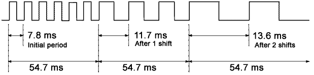
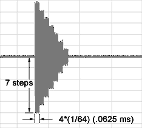
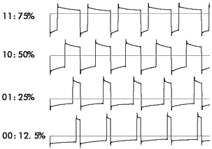
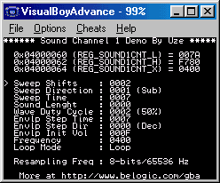

# Sound Channel 1

Sound channel 1 produces square waves with variable duty cycle, frequency sweep and envelope functions. It is often referred as a quadrangular wave pattern.

Frequency sweeps allows "portamento"-like effects where the frequency raises or decreases during playback. The amount of increase or decrease in frequency (or sweep shifts) and the rate at which it occurs (sweep time) is controllable. Frequency sweeps are controlled by REG_SOUND1CNT_L

Sweep shifts are controlled by bits 0-2 and are calculated with the following formula:

\\( T = T \pm \frac{T}{2^n} \\) where T = Wave Period and n = Sweep Shifts

Sweep time (Ts) controls the delay between sweep shifts and is controlled by bits 4-6:

- 000: Sweep function is off
- 001: Ts=1 / 128Khz (7.8 ms)
- 010: Ts=2 / 128Khz (15.6 ms)
- 011: Ts=3 / 128Khz (23.4 ms)
- 100: Ts=4 / 128Khz (31.3 ms)
- 101: Ts=5 / 128Khz (39.1 ms)
- 110: Ts=6 / 128Khz (46.9 ms)
- 111: Ts=7 / 128Khz (54.7 ms)

At each sweep shift, frequency can either increase (bit 3=0) or decrease (bit 3=1).

Next is an example of frequency sweeps when REG_SOUND1CNT_L=0x0079 (sweep shifts=1 and sweep time=54.7 ms) and the initial frequency from REG_SOUND1CNT_X=0x0400 (~128Hz, 7.8 ms period).



In the above example, frequency decreases gradually. Note that sweep shifts are repeatedly performed until the new value becomes either less than 0 (the previous value is then retained) or, when incrementing, if the new frequency value exceeds the maximum frequency (131Khz or 2048 in register value). In the latter case, the sound would then stop and DMG Sound 1 status bit from REG_SOUNDCNT_X would be reset. When either sweep shifts or sweep time is zero, the frequency remains unchanged. When the sweep function is not required, set sweep shifts and sweep time to zero and set the increase/decrease bit to 1 or otherwise, sometimes, no sound will be played.

The envelope function allows for fade-ins or fade-outs of the sound. It has a 4-bit resolution so it can produce 16 different amplitude levels (steps). The delay between step change (step time) is controlled by bits 8-10 of REG_SOUND1CNT_H. The duration of one step is given by: T= step time*(1/64) sec, hence a maximum fade time of ~1.64 seconds. When the step time is 0, the envelope function is disabled.

Bit 11 of REG_SOUND1CNT_H controls the envelope direction: 0=envelope decreases and 1=envelope increases.

The initial value of the envelope is stored in bits 12-15 of REG_SOUND1CNT_H. When decreasing, if the volume reaches 0000, the sound is muted. When increasing, if the volume reaches 1111, the envelope function stops and the volume remains at that level.



Envelope example for REG_SOUND1CNT_H=0x7400

Sound 1 can be set to either play for a specified duration or continuously. This is controlled by bit 14 of REG_SOUND1CNT_X. When set to 0 (continuous mode), sound is played continuously regardless of the length data in REG_SOUND1CNT_H. When set to 1 (timed mode), sound is played for that specified length and after that the DMG Sound 1 status bit of REG_SOUNDCNT_X is reset.

The sound length (bits 0-5 of REG_SOUND1CNT_H) is a value obtained from the following formula:

**Sound length = (64-register value)\*(1/256) seconds**

When using timed mode, after the sound length has be changed, the sound channel must be resetted via bit 15 of REG_SOUND1CNT_X.

Frequency (bits 0-10 of REG_SOUND1CNT_X) can be calculated from the following formula:

**F(Hz) = 4194304/(32\*(2048-register value)). The minimum frequency is 64Hz and the maximum is 131Khz.**

The duty cycle is the ratio of the duration (time) that a signal is ON versus the total period of the signal. The longer it is ON the greater the duty cycle. Sound channel 1 support 4 different duty cycles, which produces very distinctive sounds. Duty cycle is controlled by bit 6-7 of REG_SOUND1CNT_H.

Possible duty cycles:



All parameters can be changed dynamically while the sound is playing. The envelope initial volume parameter does not have any effects (except when set to zero) until the sound is resetted. Also, resetting the sound does not reset the oscillator (i.e.:square wave pattern is continuous) although the period is slightly longer for the cycle generated during reset (usually +~500us).

## Sound Channel 1 Demo



A comprehensive demo is included. It shows all features of sound channel 1. The demo also allows to change the resampling frequency bit contained in REG_SOUNDBIAS. Its effects, at least on channel 1, is admittedly very subtle if not unnoticeable.

```C
#include <gba.h>

void AgbMain(void){
//Play a sound on channel 1

//turn on sound circuit
REG_SOUNDCNT_X = 0x80;
//full volume, enable sound 1 to left and right
REG_SOUNDCNT_L=0x1177;
// Overall output ratio - Full
REG_SOUNDCNT_H = 2;

REG_SOUND1CNT_L=0x0056; //sweep shifts=6, increment, sweep time=39.1ms
REG_SOUND1CNT_H=0xf780; //duty=50%,envelope decrement
REG_SOUND1CNT_X=0x8400; //frequency=0x0400, loop mode

}
```