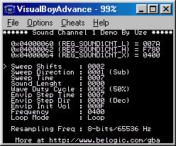

# Sound Channel 2

Sound channel 2 produces square waves with variable duty cycle and envelope functions. Channel 2 is identical to channel 1 but without the frequency sweep function.

The envelope function allows for fade-ins or fade-outs of the sound. It has a 4-bit resolution so it can produce 16 different amplitude levels (steps). The delay between step change (step time) is controlled by bits 8-10 of REG_SOUND2CNT_L. The duration of one step is given by: T= step time\*(1/64) sec, hence a maximum fade time of ~1.64 seconds. When the step time is 0, the envelope function is disabled.

Bit 11 of REG_SOUND2CNT_L controls the envelope direction: 0=envelope decreases and 1=envelope increases.

The initial value of the envelope is stored in bits 12-15 of REG_SOUND2CNT_L. When decreasing, if the volume reaches 0000, the sound is muted. When increasing, if the volume reaches 1111, the envelope function stops and the volume remains at that level.


Envelope example for REG_SOUND2CNT_L=0x7400.

Sound 2 can be set to either play for a specified duration or continuously. This is controlled by bit 14 of REG_SOUND2CNT_H. When set to 0 (continuous mode), sound is played continuously regardless of the length data in REG_SOUND2CNT_L. When set to 1 (timed mode), sound is played for that specified length and after that the DMG Sound 2 status bit of REG_SOUNDCNT_X is reset.

The sound length (bits 0-5 of REG_SOUND2CNT_L) is a value obtained from the following formula:

**Sound length = (64-register value)\*(1/256) seconds**

When using timed mode, after the sound length has be changed, the sound channel must be resetted via bit 15 of REG_SOUND2CNT_H.

Frequency (bits 0-10 of REG_SOUND2CNT_H) can be calculated from the following formula:

**F(Hz) = 4194304/(32\*(2048-register value)). The minimum frequency is 64Hz and the maximum is 131Khz.**

The duty cycle is the ratio of the duration (time) that a signal is ON versus the total period of the signal. The longer it is ON the greater the duty cycle. Sound channel 1 support 4 different duty cycles, which produces very distinctive sounds. Duty cycle is controlled by bit 6-7 of REG_SOUND2CNT_L.

Possible duty cycles:


All parameters can be changed dynamically while the sound is playing. The envelope initial volume parameter does not have any effects (except when set to zero) until the sound is resetted. Also, resetting the sound does not reset the oscillator (i.e.:square wave pattern is continuous) although the period is slightly longer for the cycle generated during reset (usually +~500us).

## Sound Channel 2 Demo



```C
#include <gba.h>

void AgbMain(void) {
  //Play a sound on channel 2

  //turn on sound circuit
  REG_SOUNDCNT_X = 0x80;
  //full volume, enable sound 2 to left and right
  REG_SOUNDCNT_L = 0x2277;
  // Overall output ratio - Full
  REG_SOUNDCNT_H = 2;

  //duty=50%,envelope decrement
  REG_SOUND2CNT_L = 0xf780;
  //frequency=0x0400, loop mode
  REG_SOUND2CNT_H = 0x8400;

}
```
