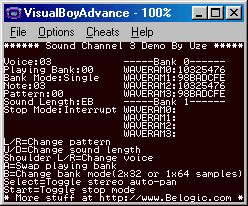
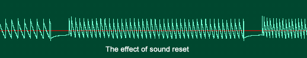
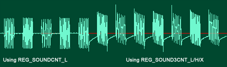

# Sound Channel 3

Channel 3 acts as a 4-bit DAC that repeatadely plays a pattern of samples. This pattern is user definable and consists of sixty-four 4-bit samples, separated in two banks and located from 0x04000090 to 0x0400009F. Channel 3 can play banks in two modes: As a single 64 samples bank or two 32 samples banks. The dual bank mode has the advantage of not needing a sound reset/restart when switching the playing bank. This allows for dynamic reloading of the wave ram without generating distortion as it was the case with previous Gameboys. Bank mode is controlled by bit 5 of REG_SOUND3CNT_L (0x0400070) and resetting it to 0 specifies dual bank mode. Bit 6 controls which bank is active for playing/reloading. If set to 0, samples are played from bank 0 and writing to the Wave Ram will store the data in Bank 1 and vice-versa.

When bit 7 is set and Initial flag (Bit 15) from REG_SOUND3CNT_X is set, the wave pattern starts to play. Both banks of Wave Ram are filled with zero upon initialization of the Gameboy, Bank 0 being selected. So writing to bank 0 implie setting bit 6 to 1 before loading Wave Ram then set it back to 0 to play it. Most emulator currently ignore banks.

Sound 3 can be set to either play for a specified duration (max 1 second) or continuously. This is controlled by bit E of REG_SOUND3CNT_H (0x0400074). When set to 0, sound 3 is played continuously regardless of the length data in REG_SOUND3CNT_H. When set to 1, sound is played for that specified length and after that, bit 2 of REG_SOUNDCNT_X is reset.

The sound length is a 8 bit value obtained from the following formula:

**Register = Note lenght(in seconds)\*256, hence a 1 second maximum And a 3.9 millisecond minimum sound duration.**

After the sound length has be changed, the sound channel must be resetted via bit F of REG_SOUND3CNT_H.

Frequency can be calculated from the following formula:

**F(hz) = 4194304/(32\*(2048-register value)). The minimum frequency is 64Hz and the maximum is 131Khz.**

When the sound is reset, it restarts at the specified frequency. Frequency setting and sound reset must be performed in a single write since both are write only. Note that in continuous mode, frequency can be changed without resetting the sound channel (the reset bit is ignored).

## Sound Channel 3 Demo



A comprehensive demo is included. It shows most features of channel 3. The demo also explores two ways of stopping the sound while its playing. The counter mode, where sound stops after the time specified in the sound lenght register, and interrupt mode, where an timer interrupt stop the sound after a period of time. The problem with counter mode is that the sound channel must be resetted before restarting another note. This causes very annoying audio artefacts as demonstrated in the following picture:



We can cleary see spikes at the end and start of the sound. In the demo select voice 1 and press start to swap between stop modes. When in counter mode, the clicks are clearly evident.

We can set a timer interrupt to stop sound after a period of time. In the handler, we stop sound by clearing channel 3's play bit or setting its volume to zero. But both approaches tends to distort the sound, though less severely than counter mode. Here's the effect:



Using the main sound output control register REG_SOUNDCNT_L, and clear the left/right output bits gives the best results.

```C
#include <gba.h>

void AgbMain(void) {
  //Play a continuous tone using channel 3

  //turn on sound circuit
  REG_SOUNDCNT_X = 0x80;
  //full volume, enable sound 3 to left and right
  REG_SOUNDCNT_L = 0x4477;
  // Overall output ratio - Full
  REG_SOUNDCNT_H = SOUND3OUTPUT1;

  //select bank 0 for writing (bank 1 playing)
  REG_SOUND3CNT_L = SOUND3BANK32 | SOUND3SETBANK1;
  //load the wave ram bank 0
  REG_WAVE_RAM0 = 0x10325476;
  REG_WAVE_RAM1 = 0x98badcfe;
  REG_WAVE_RAM2 = 0x10325476;
  REG_WAVE_RAM3 = 0x98badcfe;
  //select bank 0 for playing
  REG_SOUND3CNT_L = SOUND3BANK32 | SOUND3SETBANK0;

  REG_SOUND3CNT_L |= SOUND3PLAY;
  REG_SOUND3CNT_H = SOUND3OUTPUT1;
  //play a C-4 in loop mode
  REG_SOUND3CNT_X = SOUND3INIT | SOUND3PLAYLOOP | 1046;
}
```
