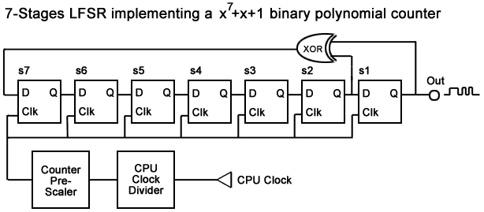
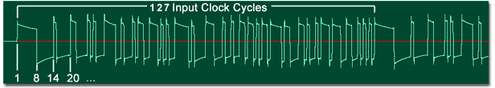

# Sound Channel 4

Sound channel 4 produces Pseudo-Noise with an envelope function. Noise is generated by a polynomial counter also known as a Linear-Feedback Shift Register (LFSR). LFSRs are special type of binary counter that have the particularity of not counting in the normal binary increment/decrement sequence. These counters find common uses in pseudorandom-numbers generation. Theory behind LFSRs and Polynomial counters are out of the scope of this document but a simple approach to key concepts will be described. Good references on the subjects are given at the end of this document.

The pseudo-noise pattern playback frequency can be controlled by a 3-bit clock divider used to divide the Sound system's clock (4.194304Mhz). The clock divider's output is then fed into a pre-scaler which output is then used as the polynomial counter's clock. The counter can be set to user either 7 or 15 stages/steps. Resulting into a 127 or 32767 input clock cycle period. Using 7 stages give more metallic sounding effects when played faster (lower divider ratios) while 15 stages sounds much like white noise.

Selection of the clock divider is done by bits 0-2 of REG_SOUND4CNT_H, where f=4.194304 Mhz/8:

- 000: f\*2
- 001: f
- 010: f/2
- 011: f/3
- 100: f/4
- 101: f/5
- 110: f/6
- 111: f/7

Bit 3 of REG_SOUND4CNT_H control the number of counter stages: 0=15 stages, 1=7 stages.

Selection of the pre-scaler divider value is done by bits 4-7 of REG_SOUND4CNT_H, where Q is the clock divider's output:

- 0000: Q/2
- 0001: Q/2^2
- 0010: Q/2^3
- 0011: Q/2^4
- ....
- 1101: Q/2^14
- 1110: Not used
- 1111: Not used

The REG_SOUND4CNT_L contains the envelope function and the sound's length and its functionality is identical to channel 1.

Bit 14 of REG_SOUND4CNT_H control the loop/timed mode. If set to 1 sound plays for the duration specified in REG_SOUND4CNT_L otherwise sound plays continuously. Bit 15 resets the sound and the LSFR counter.

All registers can be modified during playback but sound need to be reinitialized when modifying the envelope initial volume or the clock divider for changes to take effects.

## How it works

This section is more intended to emulator writers who wants to implement the exact sound of the original Gameboy sound system.

An LFSR counter with n stages can implement a maximum of (2^n)-1 states, n representing the degree of the polynomial. All zeros state is not allowed because it locks the counters. Each state in the entire count sequence is generated once and only once.

The Gameboy sound circuit implements a switchable 7/15-stages LFSR. Below is an representation of the logic used by the Gameboy. It is important to realize that channel 4 does not generate white noise per-se but Pseudo-noise. White noise is a special type of signal containing an equal amount of all frequencies and has no cycle period. LFSR counters have a cycle period of (2^n)-1 input clock cycles. Played at high speed, the pattern starts to exhibit a fundamental derived from the input clock frequency. This is clearly evident when using the 7-stages mode since the cycle is only 127 input clocks. 15-stages mode has a much bigger cycle, 32767, so the pseudo-noise sounds much more like white noise.



When initialized, all shift registers are set to 1. On each clock pulse, bits are shifted from left to right (on the picture) s1 being the least significant bit and the output that is sent to the channel's envelope generator. The count sequence for the 7-stage LFSR, once the sound channel is resetted is then:

**Counter steps**

|     |     |     |     |     |     |     |
| --- | --- | --- | --- | --- | --- | --- |
| 1   | 1   | 1   | 1   | 1   | 1   | 1   |
| 0   | 1   | 1   | 1   | 1   | 1   | 1   |
| 0   | 0   | 1   | 1   | 1   | 1   | 1   |
| 0   | 0   | 0   | 1   | 1   | 1   | 1   |
| 0   | 0   | 0   | 0   | 1   | 1   | 1   |
| 0   | 0   | 0   | 0   | 0   | 1   | 1   |
| 0   | 0   | 0   | 0   | 0   | 0   | 1   |
| 1   | 0   | 0   | 0   | 0   | 0   | 0   |
| 0   | 1   | 0   | 0   | 0   | 0   | 0   |
| 0   | 0   | 1   | 0   | 0   | 0   | 0   |
| 0   | 0   | 0   | 1   | 0   | 0   | 0   |
| 0   | 0   | 0   | 0   | 1   | 0   | 0   |
| 0   | 0   | 0   | 0   | 0   | 1   | 0   |
| 1   | 0   | 0   | 0   | 0   | 0   | 1   |
| 1   | 1   | 0   | 0   | 0   | 0   | 0   |
| 0   | 1   | 1   | 0   | 0   | 0   | 0   |
| 0   | 0   | 1   | 1   | 0   | 0   | 0   |
| 0   | 0   | 0   | 1   | 1   | 0   | 0   |
| 0   | 0   | 0   | 0   | 1   | 1   | 0   |
| 1   | 0   | 0   | 0   | 0   | 1   | 1   |
| 0   | 1   | 0   | 0   | 0   | 0   | 1   |
| 1   | 0   | 1   | 0   | 0   | 0   | 0   |
| 0   | 1   | 0   | 1   | 0   | 0   | 0   |
| 0   | 0   | 1   | 0   | 1   | 0   | 0   |
| 0   | 0   | 0   | 1   | 0   | 1   | 0   |
| 1   | 0   | 0   | 0   | 1   | 0   | 1   |
| 1   | 1   | 0   | 0   | 0   | 1   | 0   |
| 1   | 1   | 1   | 0   | 0   | 0   | 1   |
| 1   | 1   | 1   | 1   | 0   | 0   | 0   |



By looking at s1 output (the the least significant bit), we can see it matches the pattern on the picture, which is a capture of the GBA output for channel 4 in 7-stage mode. Since the counter is always counting in the same sequence, the output bits can be stored in a lookup table for fast emulation of this function. By packing the bits, a 4 KB lookup table is sufficient to represent all states for both the 7 and 15 stages of the LFSR.

### References

[n-Stage LFSR simulator Java applet](http://www.eecircle.com/applets/009/LFSR.html)

[EDN article on LFSR](http://archives.e-insite.net/archives/ednmag/reg/1996/010496/01df4.htm)

[Theory behind LFSR](http://www-math.cudenver.edu/~wcherowi/courses/m5410/m5410fsr.html)

```C
#include <gba.h>

void AgbMain(void) {
  //Play a sound on channel 4

  //turn on sound circuit
  REG_SOUNDCNT_X = 0x80;
  //full volume, enable sound 4 to left and right
  REG_SOUNDCNT_L = 0x4477;
  // Overall output ratio - Full
  REG_SOUNDCNT_H = 2;


  //envellope decay, initial vol max
  REG_SOUND4CNT_L = 0xf700;
  //Loop mode, clk div:6, 7-stage,pre-scaler:3
  REG_SOUND4CNT_H = 0x8032;

}
```
