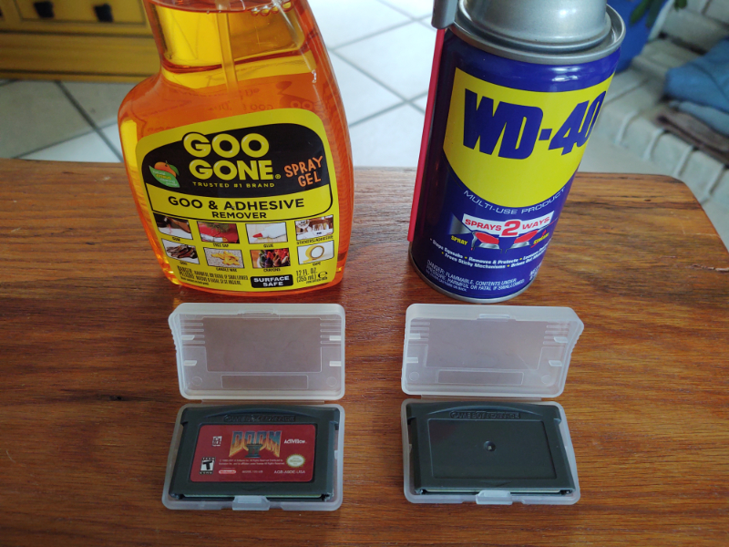
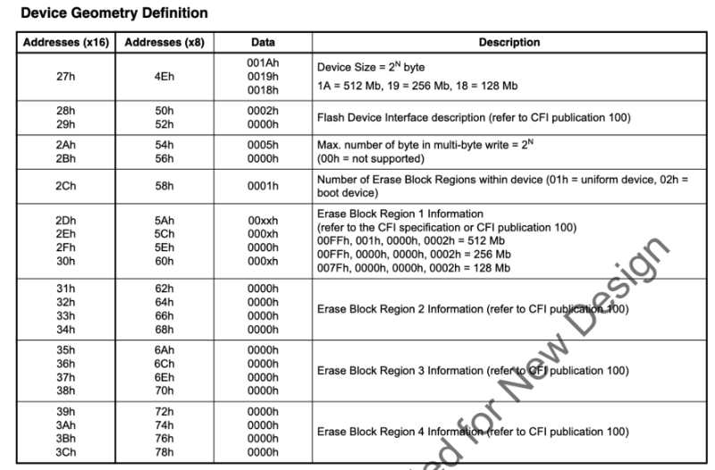

# Bootleg Carts

Bootleg carts, sometimes called repro carts, are illegal game carts sold from China.  At the time of
writing, some members of the GBADev community have purchased them for around $5/cart.

From discussion with store owners in China, these carts cannot be ordered blank -- they are created
with copywritted games already on them (usually the popular games, Pokemon, Mario, etc).

However, these carts _can_ be cleaned and overwritten with homebrew games.

This guide will describe how to develop games for bootleg carts.

1. [Size of Carts](#size-of-carts)
2. [Removing Label](#removing-label)
3. [Flashing Cart](#flashing-cart)
4. [Batteryless Saving](#batteryless-saving)
5. [Hardware Used in Carts](#hardware-used-in-carts)
6. [Swapping of D0/D1](#swapping-of-d0d1)
7. [Understanding Commands](#understanding-commands)
8. [Querying for Information](#querying-for-information)
9. [Detecting if D0/D1 are Swapped](#detecting-if-d0d1-are-swapped)
10. [Understanding Region Layout](#understanding-region-layout)
11. [Erasing a Sector](#erasing-a-sector)
12. [Saving Data](#saving-data)
13. [Final Thoughts](#final-thoughts)

## Size of Carts

The carts typically range in size from 4MB to 32MB, with 16MB being the most common.

If your game requires a lot of storage space, then you will be more restricted in which carts you
can buy.

For example, _Pokemon_ games come on 16MB carts, and _Kingdom of Hearts - Chain of Memories_ is
32MB.

## Removing Label



The carts will arrive with illegal content and label.  Some carts and cases arrive with scuff marks
as well.

To remove the label, first take the cart apart.  You will need a Y0 screw bit, sometimes called a
gamebit.  The [iFixit Moray Driver
Kit](https://www.ifixit.com/Store/Tools/Moray-Driver-Kit/IF145-475) contains one, but they can be
found in lots of places.


Some products that work with removing labels are [Goo Gone](https://googone.com/) and
[WD-40](https://www.wd40.com/).

Spray a little bit of the liquid on the label, and wait for it to soak in (Goo Gone takes about
5min).  Then scrap off the label, and wash the plastic with soap and water.


## Flashing Cart


You will need a device to connect the cart to your computer in order to overwrite the contents of
the cart with your game.

Here are some known flashers at the time of writing:

* [GBxCart RW](https://shop.insidegadgets.com/product/gbxcart-rw/)
* [Joey Jr](https://bennvenn.myshopify.com/collections/cart-flasher-dumper-reader-writer)
* [GB Operator](https://www.epilogue.co/)

I personally like GBxCart RW the best because it works on Mac OSX, runs from the command line, and
is [open source](https://github.com/lesserkuma/FlashGBX).  To flash your game using GBxCart RW,
after installing FlashGBX on your system, you run:

```bash
python3 -m FlashGBX --mode agb --action flash-rom MyGame.gba
```

Joey Jr works on Windows and doesn't require any installation, since the cart will show up as an
external drive.  You simply drag your game on to the drive in Windows Explorer (or `copy` from the
command line).

GB Operator has a user interface for playing games off of carts, and is more polished.  Writing
games to flash carts is just one feature.

Your needs may vary, and features may change over time.  Buy the best one that works for you, or
buy all of them :-).  They're pretty cheap.

## Batteryless Saving

The flashers work because the cart ROMs can be overwritten.

In the past, carts used to have batteries installed, in order to support SRAM.  However, this
increases the cost of manufacturing.

As of writing, carts are now manufactured without batteries.  Typically SRAM is available, but
contents won't persist after power off (so it acts as an 8-bit RAM).

So how can a game developer make a game that saves player progress?

By using the same technique that the flashers use - writing data to the ROM itself.

## Hardware Used in Carts


In order to flash data to the cart, you will need to know what chips are in the cart.

For this guide, I will assume the cart is using a `S29GL128N` chip.  You can usually read the chip
by using a magnifying glass and looking at the text stamped on the chip.

If you are interested in the exact specifications of the chip, you will need to track down the data
sheet for it.  [Here is the data sheet for the
S29GL128N](https://github.com/velipso/gvasm/blob/main/mirror/s29glxxxn.pdf).  It will tell you
exactly how to communicate with the chip.

Thankfully, many different chips use the same protocols, so a save routine won't need to know the
exact chip, but instead just a category of chips.

At a high level, flashing to the cart will consist of:

1. Querying the cart for sector layout
2. Erasing a sector
3. Writing the data to the sector

This is accomplished by writing special values to the ROM, at special address locations.

## Swapping of D0/D1

**IMPORTANT NOTE:** Many carts will swap the D0 and D1 lines!

This means when the specification says you need to write `0x55`, then you actually need to write
`0x56` because bits 0 and 1 are swapped (`01010101` -> `01010110`).

This also affects reading the sector layout, because the values you read will have bits 0 and 1
swapped as well.

This _does not_ affect the data written to the ROM.  If you want `0x4321` written to memory, then
just write `0x4321`, because it will be swapped on write, and swapped again on read, cancelling it
out.

## Understanding Commands

The table on page 57 shows the different commands available for the `S29GL128N`:


You can see that this information also exists in the FlashGBX source code, [in the
config](https://github.com/lesserkuma/FlashGBX/blob/9b44a9959bf9fd6bab5f1005ce1c757d2f456fa7/FlashGBX/config/fc_AGB_MSP55LV128M.txt):

```javascript
"reset":[
  [ 0, 0xF0 ]
],
"read_identifier":[
  [ 0xAAA, 0xA9 ],
  [ 0x555, 0x56 ],
  [ 0xAAA, 0x90 ]
],
"read_cfi":[
  [ 0xAA, 0x98 ]
],
...
```

Notice that the "Auto-Select" row doesn't exactly match the `"read_identifier"` information.

Auto-Select starts with address `0xAAA`, data `0xAA`, but FlashGBX has address `0xAAA`, data
`0xA9` -- this is because D0/D1 are swapped (`10101010` -> `10101001`)!  [See the section
above](#swapping-of-d0d1).

So if we want to perform a reset on the chip, we just write `0xF0` to any address.  Note that reset
doesn't _erase_ the chip, it just resets any commands in progress.

```c
// reset
*((u16 *)0x08000000) = 0xF0;
__asm("nop");
```

The forked goombacolor project from LesserKuma has example code, where [you can see this
happen](https://github.com/lesserkuma/goombacolor/blob/f2bae8eb5087de14008250032c82cf5d294131cd/src/main.c#L585):

```c
#define _FLASH_WRITE(pa, pd) { *(((u16 *)AGB_ROM)+((pa)/2)) = pd; __asm("nop"); }

// reset
_FLASH_WRITE(0, 0xF0);
// auto-select
_FLASH_WRITE(0xAAA, 0xA9);
_FLASH_WRITE(0x555, 0x56);
_FLASH_WRITE(0xAAA, 0x90);
```

**IMPORTANT NOTE:** Since we need to control the reads/writes sent to the ROM, we cannot run the
code from the ROM.  You will need to [load the code into
EWRAM](https://github.com/lesserkuma/goombacolor/blob/f2bae8eb5087de14008250032c82cf5d294131cd/src/main.c#L553)
or IWRAM so that the bus between the GBA and the cart doesn't have extra reads to execute code.

## Querying for Information

There is a standard protocol used by all flash chips called the [Common Flash Memory
Interface](https://en.wikipedia.org/wiki/Common_Flash_Memory_Interface) (CFI).

You can use CFI to query a lot of information about the chip you're interacting with.  The chip
specifications should have a section on CFI.

Two things in particular you probably want is whether D0/D1 are swapped, and the region layout.

## Detecting if D0/D1 are Swapped

You can detect if D0/D1 are swapped by putting the chip in CFI mode, then reading the bytes at
`0x20`, `0x22`, and `0x24`.  These values are hardcoded to `'Q'`, `'R'`, `'Y'`, but if D0/D1 are
swapped, you'll instead see `'R'`, `'Q'`, `'Z'`.

Here is some example code:

```c
// reset the chip
_FLASH_WRITE(0, 0xF0);
// enter CFI mode
_FLASH_WRITE(0xAA, 0x98);

// read the header
u16 Q = *(((u16 *)AGB_ROM)+(0x20/2));
u16 R = *(((u16 *)AGB_ROM)+(0x22/2));
u16 Y = *(((u16 *)AGB_ROM)+(0x24/2));
bool swapBits = false;

if (Q == 'Q' && R == 'R' && Y == 'Y') {
  // CFI mode is enabled, D0/D1 are not swapped
  swapBits = false;
}
else if (Q == 'R' && R == 'Q' && Y == 'Z') {
  // CFI mode is enabled, D0/D1 are swapped
  swapBits = true;
}
else {
  // chip didn't enter CFI mode, try something else
}
```

Once you know if D0/D1 are swapped, you can write a helper function for reading bytes from the ROM:

```c
u8 readByte(int addr, bool swapBits) {
  u8 data = *(((u16 *)AGB_ROM)+(addr/2));
  if (swapBits) {
    data =
      (data & 0xfc) |
      ((data & 1) << 1) |
      ((data & 2) >> 1);
  }
  return data;
}
```

## Understanding Region Layout

The region layout is useful for calculating where the sectors start, and how large they are.
Assuming you want to overwrite sectors at the end of the ROM, you need to figure out what
address(es) to write to.

There are 1-4 regions, and each region has a sector count and sector size.

After entering CFI mode, you can read the region layout from memory:



Here's some example code:

```c
// assuming we are already in CFI mode
int regionCount = readByte(0x58, swapBits);
struct {
  int sectorCount;
  int sectorSize;
} regions[4] = {0};

for (int region = 0; region < regionCount; region++) {
  int sectorCountLow  = readByte(0x5A + region * 8, swapBits);
  int sectorCountHigh = readByte(0x5C + region * 8, swapBits);
  int sectorSizeLow   = readByte(0x5E + region * 8, swapBits);
  int sectorSizeHigh  = readByte(0x60 + region * 8, swapBits);

  // note we must add one!
  regions[region].sectorCount =
    ((sectorCountHigh << 8) | sectorCountLow) + 1;

  // note we must multiply by 256!
  regions[region].sectorSize =
    ((sectorSizeHigh << 8) | sectorSizeLow) << 8;
}
```

## Erasing a Sector

Erasing a sector will set all the values in that sector to `0xFFFF`.

This is fairly straight forward, you can use
[goombacolor](https://github.com/lesserkuma/goombacolor/blob/f2bae8eb5087de14008250032c82cf5d294131cd/src/main.c#L657)
as a reference:

```c
// Erase flash sector
_FLASH_WRITE(sa, 0xF0);
_FLASH_WRITE(0xAAA, 0xA9);
_FLASH_WRITE(0x555, 0x56);
_FLASH_WRITE(0xAAA, 0x80);
_FLASH_WRITE(0xAAA, 0xA9);
_FLASH_WRITE(0x555, 0x56);
_FLASH_WRITE(sa, 0x30);
while (1) {
  __asm("nop");
  if (*(((u16 *)AGB_ROM)+(sa/2)) == 0xFFFF) {
    break;
  }
}
_FLASH_WRITE(sa, 0xF0);
```

You now should be able to understand this code.

This sequence of writes matches the documentation (with D0/D1 swapped).

The variable `sa` is the sector address.  The code:

1. Resets the chip
2. Erases the sector
3. Waits in a loop until it reads `0xFFFF` from the sector, indicating the erase is finished
4. Resets the chip again

## Saving Data

Once again, [goombacolor](https://github.com/lesserkuma/goombacolor/blob/f2bae8eb5087de14008250032c82cf5d294131cd/src/main.c#L673)
is a great reference:

```c
for (int i=0; i<AGB_SRAM_SIZE; i+=2) {
  _FLASH_WRITE(0xAAA, 0xA9);
  _FLASH_WRITE(0x555, 0x56);
  _FLASH_WRITE(0xAAA, 0xA0);
  _FLASH_WRITE(sa+i, (*(u8 *)(AGB_SRAM+i+1)) << 8 | (*(u8 *)(AGB_SRAM+i)));
  while (1) {
    __asm("nop");
    if (*(((u16 *)AGB_ROM)+((sa+i)/2)) == ((*(u8 *)(AGB_SRAM+i+1)) << 8 | (*(u8 *)(AGB_SRAM+i)))) {
      break;
    }
  }
}
_FLASH_WRITE(sa, 0xF0);
```

The code:

1. Issues a "Program" command for each 16-bit value
2. Writes the 16-bit value at the target address
3. Waits in a loop until it reads the written value*
4. Continues writing until all 16-bit values are written
5. Resets the chip

Note that this code copies data from SRAM into the ROM.  As a homebrew developer, you don't _have_
to do it this way -- you can just write directly to the ROM.  However, you should still have code
that saves to SRAM so that emulators can save the data.

\* You might think this loop could be incorrect if by chance, the read returns the value written
before it was actually finished.  See the section on DQ7 Data Polling on page 59 to understand why
this won't happen.  In summary, DQ7 will always be the opposite of whatever was written until the
write goes through.

## Final Thoughts

This guide is a starting point, but it cannot replace experimentation.  Now that you understand the
basic idea, here are some things you will want to consider:

1. If a user shuts off power during a save, then the save will be incomplete.  You can backup the
save into another sector to ensure the data will always be recoverable.
2. If you want your game to work on emulators, you will still need to save to SRAM.  However, if you
don't care about emulators, then you can have much larger save files (for example, reserving 8 MB
for game code, 4 MB for save data, and 4 MB for backup).
3. Different chips have different commands, so if you want to support multiple chips, you will need
a method to detect which chip you're on, and use the appropriate commands.
[FlashGBX](https://github.com/lesserkuma/FlashGBX/blob/master/FlashGBX/hw_GBxCartRW.py#L1469) and
[goombacolor](https://github.com/lesserkuma/goombacolor/blob/main/src/main.c#L554)
are great references for this, and they both use different methods.
